# Detailed tutorial: platform admin, hotel manager, and frontend

This runbook explains exactly how to reproduce the views shown in screenshots.

All screenshots in this document were captured on February 28, 2026 from:
- Admin app: `http://localhost:3001`
- Frontend app: `http://localhost:3000`

## 1. Prerequisites

1. Install dependencies at repository root:
   - `npm install`
2. Start full local stack:
   - `./dev.sh --reset-db`
3. Keep the dev stack running while following steps.
4. Confirm ports are reachable:
   - Admin: `http://localhost:3001/login`
   - Frontend: `http://localhost:3000/fr/login`
   - Backend API: `http://localhost:4000`

## 2. Demo credentials

Use these exact accounts:

1. Platform admin
   - Login URL: `http://localhost:3001/login?type=platform`
   - Email: `admin@mystay.com`
   - Password: `admin123`
2. Hotel manager
   - Login URL: `http://localhost:3001/login?type=staff`
   - Email: `manager@fourseasons.demo`
   - Password: `admin123`
3. Frontend guest
   - Login URL: `http://localhost:3000/fr/login`
   - Email: `sophie.martin@email.com`
   - Password: `admin123`

## 3. Platform admin flow (step by step)

### Step A: open platform login

1. Go to `http://localhost:3001/login?type=platform`.
2. Ensure the `Platform Admin` toggle is selected.
3. Sign in with `admin@mystay.com` / `admin123`.

Expected screen:

### Step B: landing dashboard

1. After login, you should land on `/platform`.
2. Confirm global platform summary cards are visible.

Expected screen:

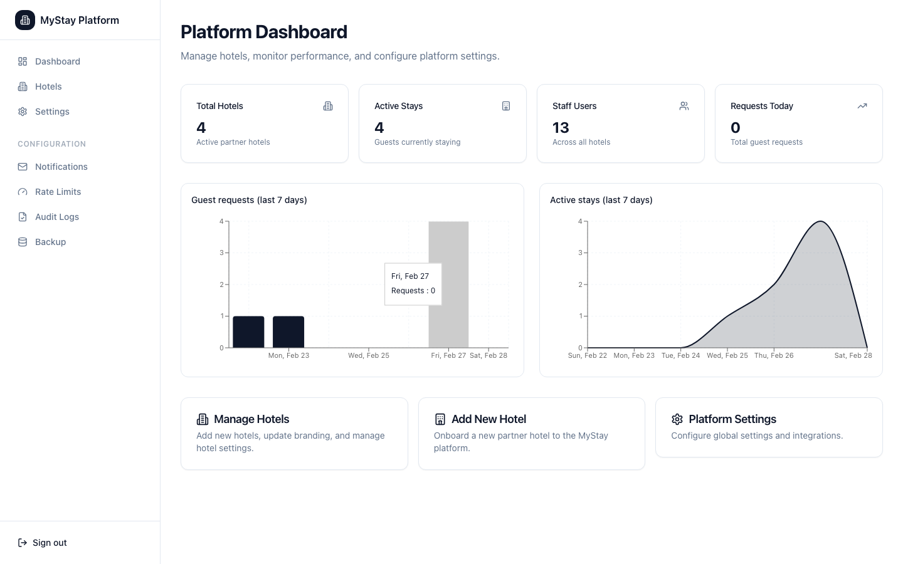

### Step C: hotels management

1. Open `http://localhost:3001/platform/hotels`.
2. Verify hotel list and management actions are visible.

Expected screen:

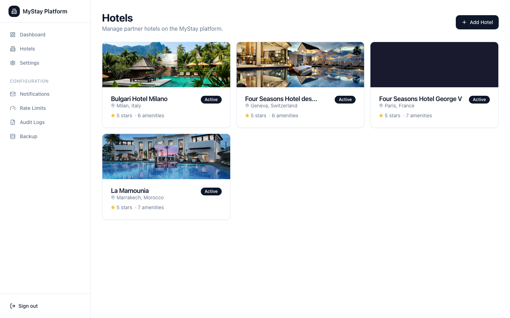

### Step D: platform settings

1. Open `http://localhost:3001/platform/settings`.
2. Verify settings sections (backup/rate limits/notifications/audit scope).

Expected screen:

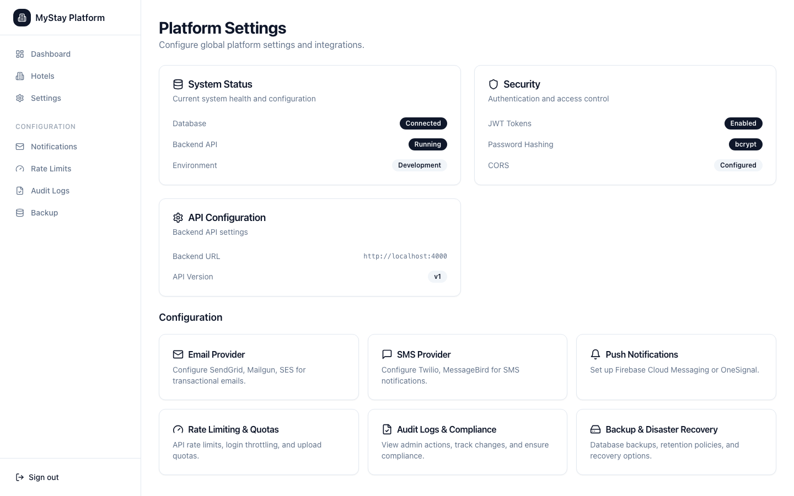

## 4. Hotel manager flow (step by step)

### Step A: open hotel staff login

1. Go to `http://localhost:3001/login?type=staff`.
2. Ensure `Hotel Staff` toggle is selected.
3. Sign in with `manager@fourseasons.demo` / `admin123`.

Expected screen:

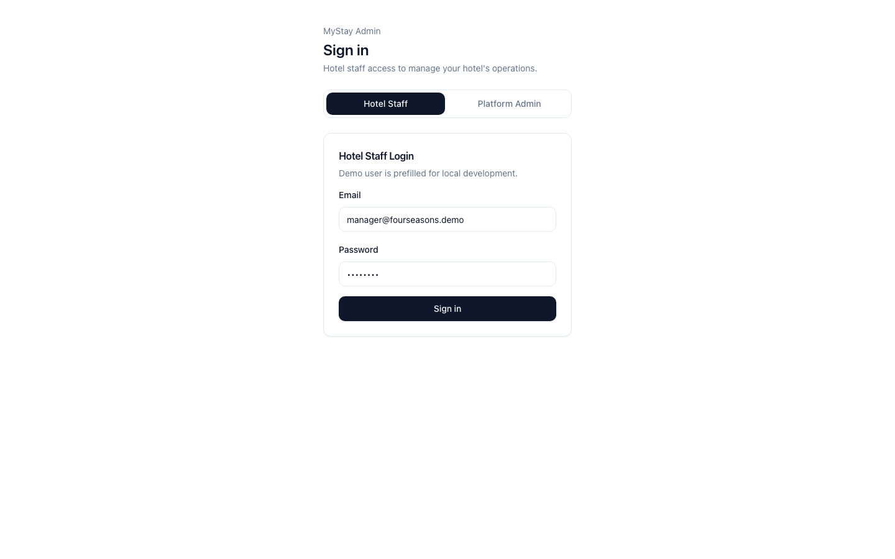

### Step B: manager dashboard

1. After login, you should land on `/`.
2. Confirm operational dashboard cards and links are visible.

Expected screen:

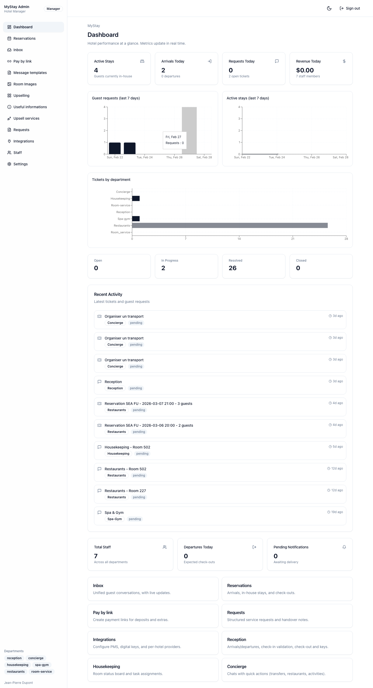

### Step C: reservations page

1. Click `Reservations` in left nav, or open `http://localhost:3001/reservations`.
2. Verify arrivals/departures and reservation rows load.

Expected screen:

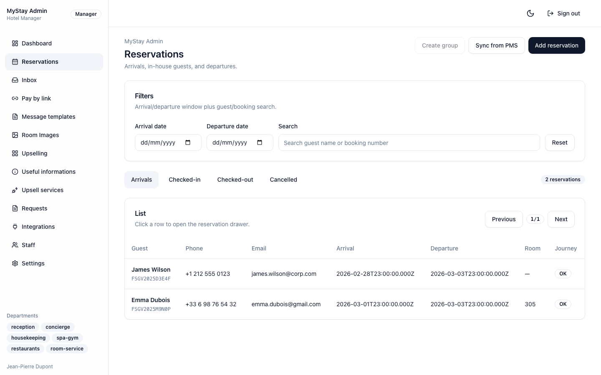

### Step D: inbox page

1. Click `Inbox` in left nav, or open `http://localhost:3001/inbox`.
2. Verify threads list and message panel render.

Expected screen:

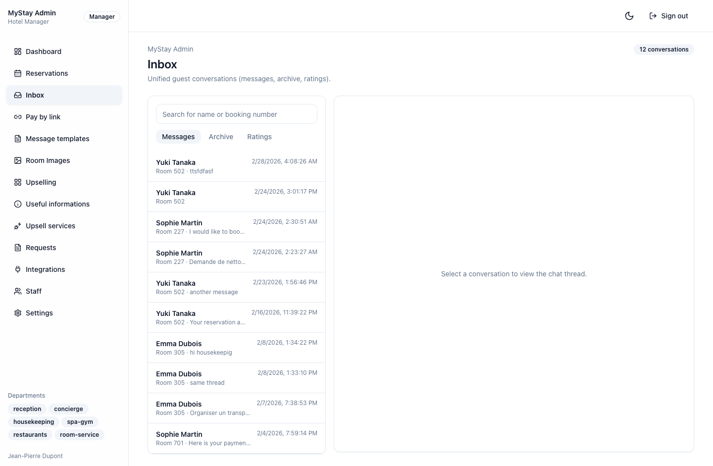

### Step E: housekeeping board (important)

This is the specific issue you raised.

How to get the exact screenshot `05-housekeeping.png`:

1. Login with a `manager` or `admin` account.
2. Open `http://localhost:3001/housekeeping` directly in the browser.
3. Do not use a `staff`-only account; middleware blocks this route for non-manager roles.

Expected screen:

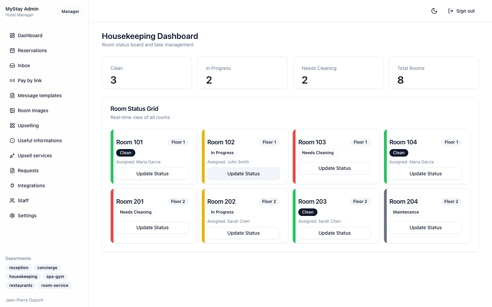

Notes about `/housekeeping`:

1. The board route exists and works.
2. It may not appear in the left sidebar navigation.
3. Dashboard has a `Housekeeping` tile, but that tile currently links to `/inbox?dept=housekeeping` (filtered inbox), not the dedicated board route `/housekeeping`.
4. If you are redirected to `/`, your account role is likely not `manager` or `admin`.

## 5. Frontend guest flow (step by step)

### Step A: guest login

1. Open `http://localhost:3000/fr/login`.
2. Sign in with `sophie.martin@email.com` / `admin123`.

Expected screen:

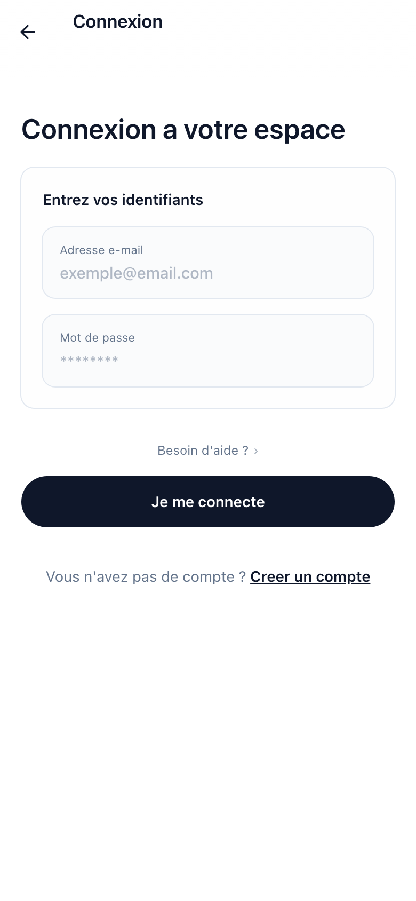

### Step B: experience home

1. Open `http://localhost:3000/fr/experience`.
2. Verify guest home sections are visible.

Expected screen:

### Step C: services hub

1. Open `http://localhost:3000/fr/services`.
2. Verify services cards are visible.

Expected screen:

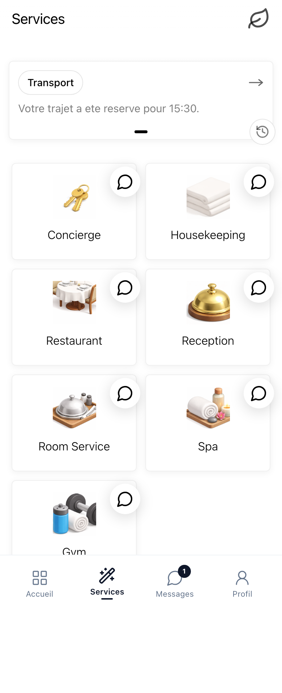

### Step D: spa page

1. Open `http://localhost:3000/fr/spa`.
2. Verify spa content and booking entry points.

Expected screen:

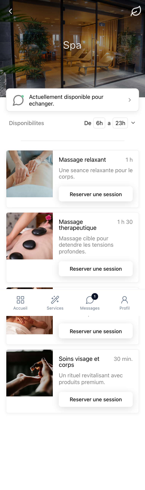

### Step E: profile page

1. Open `http://localhost:3000/fr/profile`.
2. Verify profile summary and preferences area.

Expected screen:

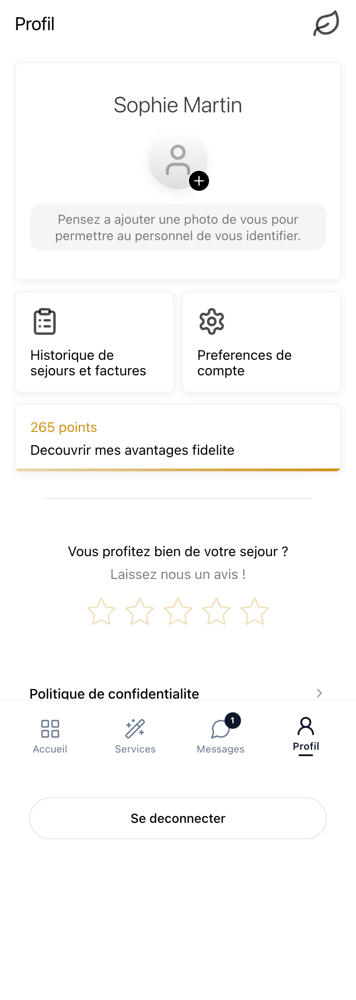

## 6. Troubleshooting

1. Redirected to `/login`:
   - Session cookie is missing or expired. Re-login.
2. Redirected from `/housekeeping` to `/`:
   - Logged-in role is not `manager`/`admin`. Use `manager@fourseasons.demo`.
3. Pages load but no data:
   - Backend or DB seed not ready. Restart with `./dev.sh --reset-db`.
4. Login fails with valid credentials:
   - Confirm backend is running on `http://localhost:4000` and seed completed.
5. Frontend page appears to hang:
   - Wait a few seconds and refresh once; some routes rely on async API calls.

## 7. Screenshot inventory

Platform admin:
- `doc/tutorial-assets/platform-admin/01-login.png`
- `doc/tutorial-assets/platform-admin/02-dashboard.png`
- `doc/tutorial-assets/platform-admin/03-hotels.png`
- `doc/tutorial-assets/platform-admin/04-settings.png`

Hotel manager:
- `doc/tutorial-assets/hotel-manager/01-login.png`
- `doc/tutorial-assets/hotel-manager/02-dashboard.png`
- `doc/tutorial-assets/hotel-manager/03-reservations.png`
- `doc/tutorial-assets/hotel-manager/04-inbox.png`
- `doc/tutorial-assets/hotel-manager/05-housekeeping.png`

Frontend:
- `doc/tutorial-assets/frontend/01-login.png`
- `doc/tutorial-assets/frontend/02-experience-home.png`
- `doc/tutorial-assets/frontend/03-services.png`
- `doc/tutorial-assets/frontend/04-spa.png`
- `doc/tutorial-assets/frontend/05-profile.png`
